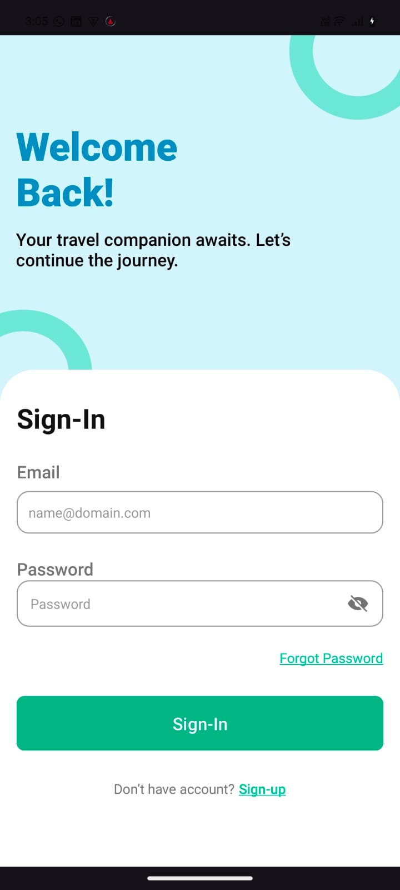
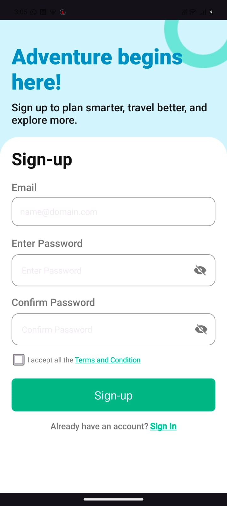
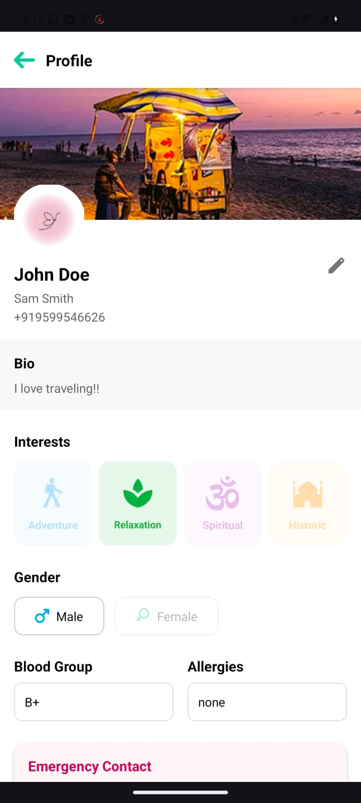
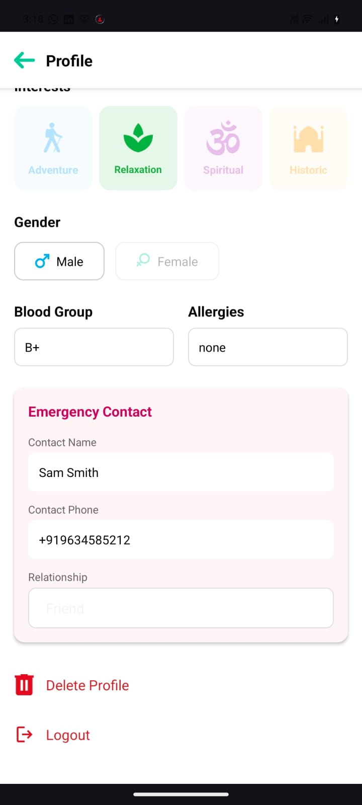
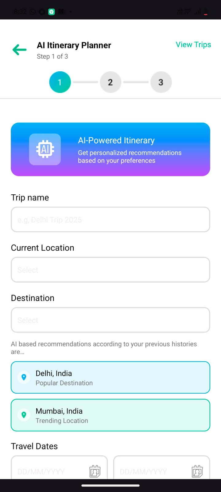
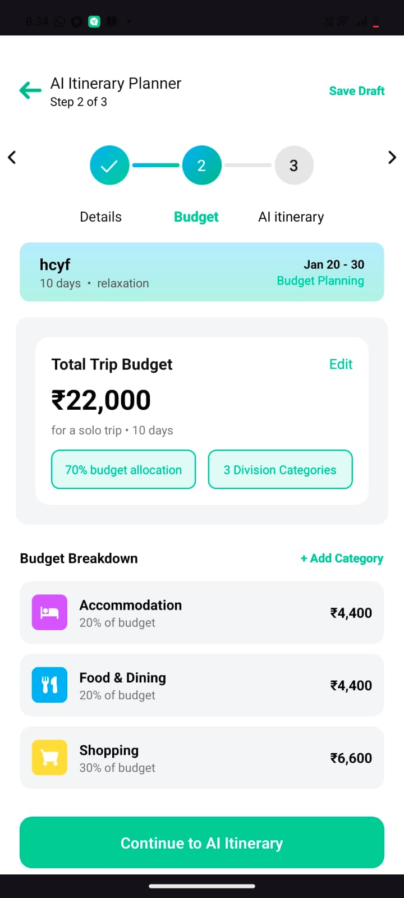
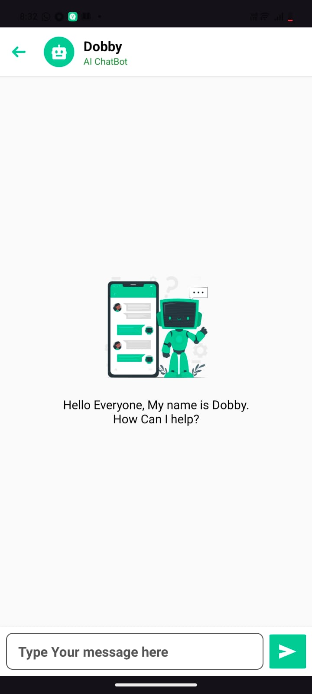
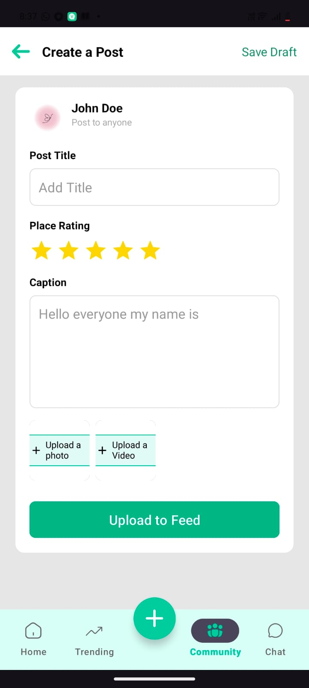
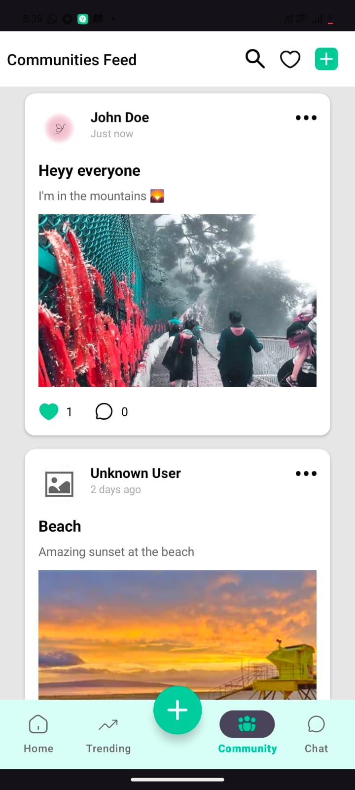

# ✈️ TripSync  
### AI-Powered Group Travel Planning & Experience Management Platform

---

## 🔗 Overview
**TripSync** is an intelligent travel management platform designed to simplify and enhance **group travel experiences**. It combines **AI-driven itinerary planning**, **real-time expense tracking**, **seamless communication**, and **social interaction** into a single application.

The core idea of TripSync is:  
**Smart Planning + Real-Time Coordination + Shared Experiences**,  
allowing travelers to focus more on the journey and less on logistics.

---

## 🔗 Problem Statement
Group travel often becomes stressful due to:
- Unorganized itineraries  
- Confusion in expense splitting  
- Lack of real-time coordination  
- Poor safety measures during emergencies  
- No centralized place to capture and relive travel moments  

Most existing travel apps focus on individual travelers or only trip planning, not on end-to-end group travel management.

---

## 🔗 Solution
TripSync provides a unified platform for planning, managing, and experiencing trips together. It enables users to:
- Plan trips collaboratively using AI  
- Track expenses transparently  
- Stay connected through in-app chat  
- Ensure safety with an Emergency SOS system  
- Build a travel-focused social community  

---

## 🔗 AI Component: AI-Based Itinerary Planner

### Inputs
- Destination  
- Number of days  
- Budget  
- Preferred activity genres  

### Model Function
- Generates a personalized, day-wise itinerary  

### Output
- Custom AI-generated itinerary (fully editable)  

### Purpose
- Reduce planning effort  
- Improve overall travel experience quality  

---

## 🔗 Key Features

- Secure JWT token-based Authentication
- Email-based signup & login with OTP verification  
- Create trips with destination and dates  
- Set total and daily budgets and categorize them
- Invite and add tripmates  
- Real-time synchronization of updates  
- WebSocket-based real-time messaging  
- One-tap SOS button  
- Mini Social Travel Community
- AI Chatbot  
- Rating System  
- Current weather at destination  

## 🔗 Future Enhancements
- Offline itinerary access  
- AI-based budget prediction  
- Integration with booking platforms  
- Advanced location-based recommendations  
- Smart travel analytics  

---

## 📸 App Screenshots

### 🔐 Authentication

  
  

### 👤 Profiles 

  
  

### 🗺️ AI Itinerary Planner

  
  

### 💬 Group Chats

  
  

### 🌍 Community & Social

  
  
  

### 🚨 Emergency SOS

  

## 🎥 Feature Demo Videos

- 🔐 Authentication Flow → [Watch Video](assets/screenshots/auth.mp4)
- 🗺️ Itinerary Planning → [Watch Video](assets/screenshots/itinerary.mp4)
- 💬 Group Chats → [Watch Video](assets/screenshots/chats.mp4)
- 👤 Profile Creation → [Watch Video](assets/screenshots/profilecreation.mp4)
